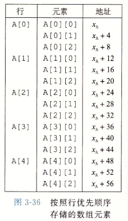
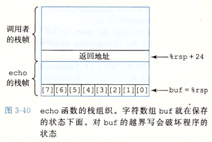
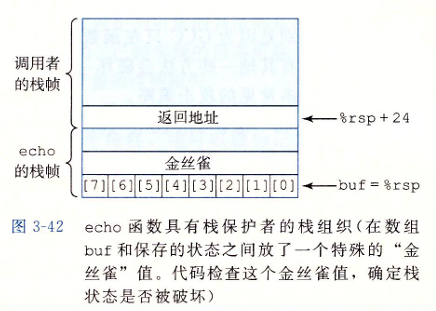

# CSAPP-程序的机器级表示

## 前言

​		在我们的日常生活中， 我们编写程序最常使用的语言大概率会是 `C`, `C++`, `Java`, `Go`, `python` 这些高级语言，但是实际上计算机并不能直接的理解我们所编写的程序，计算机能理解的是一个个由 `0`, `1` 构成的字节序列， 为了理解计算机的底层原理， 我们如果根一个个字节序列打交道的化不免会觉得头痛， 所以我们在这一章中主要会于汇编语言 “眉来眼去”.....所以让我们一起走进汇编的世界吧


## 程序编译过程

我们简单的了解一下一个 C 语言程序是如何被编译为一个二进制程序的：

在 Linux 系统中， `gcc` 是默认的 `C/C++` 编译器， 除此之外他也是一个非常常用的编译器， 我们假设现在有一个 C 语言的程序 `hello.c`，我们编译的代码为 ：

```linux
gcc hello.c
```

或者我们指定特定的优化等级

```linux
gcc -Og -S hello.c
gcc -O1 -S hello.c
gcc -O2 -S hello.c
```

> **优化等级**
>
> 我们在本章使用的优化等级均为 `-Og`
>
> * `-Og` ： 这个命令告诉编译器生成符合原始 C 代码整体架构的机器代码
>
> 如果我们使用 `-O1` 或者 `-O2` 会使我们不容易阅读反汇编的代码
>
> 不过在实际生产中 `-O1`, `-O2` 的优化效率比 `-Og` 要好

在调用 `gcc` 的编译指令后， gcc会调用一系列指令群，将 `#include` 指定的文件插入，并且拓展所有的 `#define` 声明定义的宏

接着汇编器会将文本文件转化为机器代码，它包含所有的指令的二进制表示，但还没有填写全局值得地址

最后连链接器实现对于库函数得合并，最后得到最终得可执行代码


## 机器代码以及反汇编

对于计算机级得编程来说， 有两种非常重要得抽象

* 指令集体系结构或指令集架构抽象 (ISA) 

  > **封装了机器级程序得格式和行为，定义了处理器状态，指令格式等等**
  >
  > 在第四章-处理器体系结构中将会有更深的了解, ISA 主要定义了如何去编写汇编语言, 即汇编语言的语法以及格式, 同时也是告诉 CPU 的设计者如何解析这些汇编指令构建的二进制指令

* 将内存地址抽象为虚拟地址

  > **机器级程序将内存视为一个巨大的字节数组**
  >
  > 在第九章-虚拟内存中将会有更深的了解, 整个虚拟内存系统提供给 CPU 一种抽象, 让CPU认为内存是一个巨大的连续的字节数组

就如同 C 语言对于底层细节的封装一样，机器代码也是得益于对上面的两种抽象，才能更好的执行指令

汇编代码表示非常接近于机器代码，主要特点是更加的易读

区别于 C 语言， 汇编代码对程序员可见的部分有 ：

* **程序计数器** ：（表示为 `PC`， 在 x86-64 表示为 `%rip`），表示下一条指令在内存中的地址
* **整数寄存器** ：（一共有 $16$ 个这样的 $64$ 位寄存器）,用来存储地址或整数数据，用于临时保存
* **条件码寄存器**：保存最近的执行的算术逻辑，用来实现逻辑控制
* **一组向量寄存器** : 用来存放一个或者多个整数和浮点数值


### 如何生成一个汇编代码

假设我们现在有这样一个 C 语言程序 `mul.c`

```c
void mul(long a, long b, long* ans) {
    * ans = a * b;
}
int main()
{
    long tem = 0;
    mul(100, 70, &tem);
}
```

如果我们想要得到这个代码的汇编代码形式，我们可以用如下 `gcc` 的命令

```
gcc -Og -S mul.c
```

`-S` 代表产生一个汇编文件 `mul.s` ， 如同如下的形式：

```assembly
	.file	"mul.c"
	.text
	.globl	mul
	.type	mul, @function
mul:
.LFB0:
	.cfi_startproc
	imulq	%rsi, %rdi
	movq	%rdi, (%rdx)
	ret
	.cfi_endproc
.LFE0:
	.size	mul, .-mul
	.globl	main
	.type	main, @function
main:
.LFB1:
	.cfi_startproc
	subq	$16, %rsp
	.cfi_def_cfa_offset 24
	movq	$0, 8(%rsp)
	leaq	8(%rsp), %rdx
	movl	$70, %esi
	movl	$100, %edi
	call	mul
	addq	$16, %rsp
	.cfi_def_cfa_offset 8
	ret
	.cfi_endproc
.LFE1:
	.size	main, .-main
	.ident	"GCC: (GNU) 4.8.5 20150623 (Red Hat 4.8.5-44)"
	.section	.note.GNU-stack,"",@progbits
```

汇编代码中所有以 `.` 开头的行都是指导汇编器和链接器工作的伪指令,  我们去掉后就可以看到主要的代码逻辑

```assembly
mul:
	imulq	%rsi, %rdi
	movq	%rdi, (%rdx)
	ret
main:
	movq	$0, 8(%rsp)
	leaq	8(%rsp), %rdx
	movl	$70, %esi
	movl	$100, %edi
	call	mul
	addq	$16, %rsp
	ret
```

### 反汇编

但是有些时候我们只有一个可运行的文件，我们到底怎么才能明白其中的逻辑呢？

我们就可以使用 **反汇编工具**

对于上面的程序， 如果我们直接用 `gcc` 编译的话， 我们可以得到一个 `a.out` 的可执行文件

我们可以通过下面的指令来得到反汇编的结果

```
objdump -d a.out 
```

我们截取其中关于函数的一部分来看看：

```
00000000004004ed <mul>:
  4004ed:	48 0f af fe          	imul   %rsi,%rdi
  4004f1:	48 89 3a             	mov    %rdi,(%rdx)
  4004f4:	c3                   	retq   

00000000004004f5 <main>:
  4004f5:	48 83 ec 10          	sub    $0x10,%rsp
  4004f9:	48 c7 44 24 08 00 00 	movq   $0x0,0x8(%rsp)
  400500:	00 00 
  400502:	48 8d 54 24 08       	lea    0x8(%rsp),%rdx
  400507:	be 46 00 00 00       	mov    $0x46,%esi
  40050c:	bf 64 00 00 00       	mov    $0x64,%edi
  400511:	e8 d7 ff ff ff       	callq  4004ed <mul>
  400516:	48 83 c4 10          	add    $0x10,%rsp
  40051a:	c3                   	retq   
  40051b:	0f 1f 44 00 00       	nopl   0x0(%rax,%rax,1)
```

可以发现，这和我们之前生成的汇编语言有异曲同工之妙

左边是对应的字节序列，右边则是等价的汇编代码

值得注意的是：反编译是直接用过字节序列来分析得出的汇编代码，是不会也不能分析源文件的


## 寄存器一览表


这张表只是让大家对寄存器的名字以及主要用途有个简单的了解，具体的我们后面会说


## 操作数指示符

我们将操作数分为以下的三种 ：

* 立即数 : 以 `$` 后面跟着一个整数表示， 如 `$0x34` 或者 `$-5434`
* 寄存器 ： 表示寄存器的内容
* 内存引用 : 根据计算的有效地址访问某个内存位置

常见的寻址模式 ：


建议做一下练习 3.1, 做完你会感谢我的

## 数据传送指令

`MOV` 指令一览


- **源操作数指定的值是一个立即数，存储在寄存器种或内存中**
- **目的操作数为内存位置or寄存器**
- **x86-64的限制：传送指令的两个操作数不能都指向内存位置**

movl 指令以寄存器作为目的时，会把该寄存器的高位4字节设置为0， 而对于其他 `mov` 指令，则不会修改他们的高位

对于常规的 `MOV` 指令，操作的字节数随计算机改变而改变， 所以我们可以通过类似 `movabsq` 来明确规定转移的字节数

**movabsq**指令能够以任意**64位立即数**作为源操作数，并且只能以**寄存器**作为目的

> `MOV` 指令的使用以及寻址方法实例


> 我们可以通过下面的图片来看到不同指令的区别
>
> 

除此之外，还有拓展数字位数的操作

**无符号整数拓展**


**有符号整数拓展**


`cltq` 相当于 `movslq %eax %rax` , 但是 `ctlq` 更加的编码紧凑


总结和补充一下 `MOV` 指令的相关细节

> 1. mov指令的后缀规定了源和目的地所操作数的最大位数
>
> 如果源和目的地的位数不同, 就会发生截断或者零拓展, 其次, 源或者目的地必需有一方的位数和`mov` 后缀指定的大小一致
>
> 2. 如果源或者目的地有一方是内存地址, 那么mov指令的后缀实际上值得是从那个内存地址开始读取的位数
> 3. 内存地址要看 CPU的运行模式, 如果运行的是32位程序, 那么内存地址必需使用32位的地址, 如果运行64位程序那么地址就必须是64位
> 4. `MOV` 指令源和目的地的位数必需一样, 或者可以被拓展成一样的位数


## 压入和弹出栈操作

栈的结构与运行模式都与计算机底层的逻辑相符合

栈主要有两种操作， 放入栈 `pushq` ， 弹出栈 `popq` 

栈指针是 `%rsp` , 每次压入栈指针会减少 $8$ ，紧接着再放入元素，如果是弹出元素， 那么就将栈指针直接增加 $8$


## 算数和逻辑操作

所有的算数逻辑操作都有四种变种，代表操作的字节数的不同，与 `MOV` 类相同，不做演示


> `leap` 操作解释

我们用一些典型的 `leap` 指令的实例来讲解

```assembly
leap (%rdi, %rsi, 4), %rax
leap (%rdx, %rdx, 2), %rdx
```

我们发现 `leap` 的左边长得酷似寻址操作, 但是实际上 `leap` 不会访问任何内存, 你可以简单的理解为将左边的计算结果储存在后面的寄存器中

所以对于上面的两条指令, 对应的寄存器的值为 :

`%rax = 4 * %rsi + %rdi`		`%rdx = 2 * %rdx + %rdx`


> 移位操作补充

移位指令的移位量可以是一个立即数, 也可以是一个寄存器, 但注意, **这个寄存器只能是 `%cl`**

对于操作位长为 $w$ 的数据来说, 移位量是由 `%cl` 寄存器的低 $m$ 位决定的, 这里 $2^m = w$


> 特殊的算数操作 / 除法


主要可以分成三种情况

1. 两个 $64$ 位数字相乘会产生 $128$ 位的结果, 如果使用 `imulq` 或者 `mulq` 的话, 高 $64$ 位结果会存储在 `%rdx` 中, 低 $64$ 位会存储在 `%rax` 中, CPU 可以根据 `imulq` 后面操作数的个数来判断进行何种操作

2. `clto` 指令会将`%rax`符号位拓展至 `%rdx`所有位, 如果符号位是 $0$ 则拓展成 $[00\dots00]$, 否则为 $[11\dots11]$

3. 对于除法来说 : 被除数存储在 `%rdx`(高 $64$ 位) 和 `%rax` (低 $64$ 位), 被除数由你自己指定

   > 所以对于有符号出发来说, 一般除之前使用 `clto`
   >
   > 对于无符号则将 `%rdx` 设为 $0$

4. 除法的结果 : 余数存储在 `%rdx` , 商存储在 `%rax` 中


## 汇编实现控制

### 条件码

除了整数寄存器， CPU 还替我们自动维护了一个条件码寄存器，记录着最近的算数和逻辑运算是否符合某些条件

最常用的条件码有 ：

* `CF` ： 进位标志，最近的操作使最高位的位数有所增加，可以用来判断是否溢出
* `ZF` ： 零标志， 最近的操作得到的结果是 $0$
* `SF`： 符号标志： 最近的操作得到的结果为负数
* `OF` ： 溢出标志： 最近的操作导致了一个补码溢出， 包括真溢出和负溢出


除了上面我们提到的算数和逻辑操作， 还有两种操作可以影响条件码

他们分别是 `CMP` 和 `TEST` 指令， 他们只会修改条件码，而不会修改原来的值


### 访问条件码

条件码寄存器一般不能直接读取，我们使用条件码常见的方式有三种

* 根据条件码的组合，将一个字节设为 $0$ 或 $1$
* 根据条件跳转程序的另一个地方
* 可以有条件的传送数据

我们先介绍第一种方式， 我们使用 `SET` 指令


我们简单演示以下如何使用条件码来进行比较：

```assembly
cmp:
	cmpq  %rsi %rdi 
	setl  %al
	movzbl  %al %eax
	ret
```


### 跳转指令

跳转指令分为 ：**直接跳转** 和 **间接跳转**：

* 直接跳转的跳转目标是作为指令的一部分编码的（ `jmp .L1`）
* 间接跳转跳转目标是从寄存器或内存位置中读出的（ `jmp *(%rax)`）


注意：**条件跳转只能是直接跳转**

- 执行pc相对寻址时，程序计数器的值是跳转指令后面的那条指令的地址。而不是跳转指令本身的地址


### 汇编实现条件分支

#### 使用条件控制实现条件分支

我们在 C 语言中实现条件分支的方式就是使用 `if-else` 方式，我们考虑下面这个函数

```c
int aLarge = 0, bLarge = 0;
long absDiff(long a, long b) {
    long result = 0;
    if(a > b) {
        aLarge ++; result = a - b;
    }else {
        bLarge ++; result = b - a;
    }
    return result;
}
```

但实际上，汇编语言的实现与 `goto` 的版本更像一点，虽然 `goto` 写法是一个非常不好的代码风格，但是对于我们理解汇编代码的实现有着不俗的作用， 所以我们附上 `goto` 版本的实现

```c
int aLarge = 0, bLarge = 0;
long absDiffUseGOTO(long a, long b) {
    if(a > b)
        goto other;
    bLarge ++; return b - a;
other:
    aLarge ++; return a - b;
}
```

而条件分支的汇编实现如下所示：

```assembly
// a in %rdi, b in %rsi
absDiff:
	cmpq %rsi %rdi
	jge .L2
	addq $1 aLarge(%rip)
	movq %rsi %rax
	subq %rdi %rax
	ret
.L2:
	addq $1 bLarge(%rip)
	movq %rdi %rax
	subq %rsi %rax
	ret
```

发现实际上和 `goto` 版本的实现有异曲同工之妙， 类似的，大家也可以实现其他的条件分支语句


#### 使用条件传送来实现条件分支

我们首先要了解处理器是如何提高效率的才能更好的理解这一个部分的用意	

​		处理器为了能够更好的提升效率， 采用流水线的模式，也就是说, CPU 会将一个指令分成若干个不同的步骤, 不同的步骤由不同的硬件来执行, 换句话来说, 当条件判断指令还没有执行完的时候, 后面的语句就已经开始执行了

​		举个例子，之前的 `absDiff` 函数， 哪怕要进入 `.L2` ， 后面的 `addq $1 aLarge(%rip)`  等等指令都可能被执行，从而浪费时间

​		为此， CPU 引入了一种分支预测手段，即猜测逻辑运算的结果，大部分情况下都是可以预测正确的，但是也有预测效率非常低下的情况，如果预测错误， 将会带来许许多多的多余时间，所以有些时候为了避免这种情况， 于是就可以使用条件传送来实现条件分支

​		我们先来看看一些指令， 他们都是根据不同的条件码来判断是否要执行 `MOV` 操作


我们简单演示一下，对于之前的 `absDiff` 函数， 我们可以写成如下的形式， 这个形式实际上和条件传送非常相近：

```c
long absDiffByCondition(long a, long b) {
    long tem1 = a - b;
    long tem2 = b - a;
    long c = a > b;
    if(c) tem2 = tem1;
    return tem2;
}
```

注意, 没有 `aLarge` 和 `bLarge` 的增加操作, 条件传送指令只适用于简单的语句

上面代码对应的汇编代码是 ：

```assembly
// a in %rdi, b in %rsi
absDiffByCondition:
	movq %rsi %rax
	subq %rdi %rax
	movq %rdi %rdx
	subq %rsi %rdx
	cmpq %rsi %rdi
	cmovge %rdx %rax
	ret
```

可以发现, 这段代码没有 `JUMP` 指令了， 这样代码的实际利用率就达到了 100%， 从而提高了效率

要注意的是条件传送只有在一定的条件下才可以使用，因为他是计算了两个分支的值，如果分支中有别的作用，就会导致错误，这时候只能使用条件控制分支

> **补充** : (下面的内容是第四章的内容, 这里是本人学完本书回顾时添加的注)
>
> 我们来详细说明一下为什么使用条件传送指令可以让流水线达到 100% 的利用率 :
>
> 我们以第四章 `Y86-64` 处理器体系结构为基础, `Y86-64` 处理器执行一条指令分为五个阶段 :
>
> **更新PC,	取指,	 译码,	执行,	访存** , 我们将这 $5$ 个操作从 $0$ 开始编号, 也将指令编号
>
> ```assembly
> absDiffByCondition:
> 	movq %rsi %rax	# A
> 	subq %rdi %rax	# B
> 	movq %rdi %rdx	# C
> 	subq %rsi %rdx	# D
> 	cmpq %rsi %rdi	# E
> 	cmovge %rdx %rax	# F
> 	ret					# G
> ```
>
> 我们假设某一个时钟周期, CPU内指令的流水线为 : $G_0, F_1, E_2, D_3, C_4$ 
>
> 这个时候 `F` 指令的取指完成, 比较指令译码完成
>
> 这个时钟周期结束后, 流水线为 : $H_0, G_1, F_2, E_3, D_4$ 
>
> 这个时候, `F` 指令在译码阶段, `E` 指令在执行阶段, 注意 **执行阶段会设置条件码!!!!**, 也就是说在这个时钟周期内, 比较的结果已经确定了
>
> 下一个时钟周期, `F` 指令根据 条件码来判断时候执行, 此时条件码是正确的比较结果, 所以不需要预测了
>
> 回顾整个过程, 流水线没有任何冒险, 所以效率达到了 100%
>
>  
>
> PS : 编译器其实很少使用条件传送来实现条件分支, 因为编译器没有可靠的信息来支撑它做这个决定
>
> 同时要求条件传送提前计算的两个值运算简单并且无错误
>
> 所以一般情况下还是使用条件控制来实现, 虽然预测错误的代价往往会很高(大部分情况会高于复杂的计算)


### 汇编实现循环控制

#### do - while 循环

`do-while` 的 C 语言格式为：

```c
do {
    循环体
} while(条件)
```

对应的汇编格式为 

```assembly
function:
	语句...
	JUMP function // 通过条件码判断跳转
```

举个例子：

```c
long fact_do(long n) {
    long result = 1;
    do {
		result *= n;
		n = n-1;
    } while (n > 1);
    return result;
}
```

对应的汇编代码为：

```assembly
fact_do:
	movl	$1, %eax
.L2:
	imulq	%rdi, %rax
	subq	$1, %rdi
	cmpq	$1, %rdi
	jg	.L2
	rep; ret
```


#### while 循环

`while` 的 C 语言格式为：

```c
while (条件)
    循环语句
```

翻译为汇编代码有两种形式，分别为 `jump to middle` 和 `guarded-do`

* `jump to middle`

  ```assembly
  JUMP test
  loop:
  	循环语句
  test:
  	t = 测试条件
  	JUMP loop // 根据测试条件判断时候跳转
  ```

* `guarded-do` (使用-O1优化会采用这种方法)

  ```assembly
  t = 测试条件
  JUMP done
  loop:
  	循环语句
  	t = 测试条件
  	JUMP loop // 根据条件判断是否跳转
  done
  ```

  简单来说就是先判断条件是否成立， 不成立直接结束， 之后转化为 `do-while` 格式

举个例子：

```c
long fact_while(long n) {
    long result = 1;
    while (n > 1) {
		result *= n;
		n = n-1;
    }
    return result;
}
```

对应的汇编代码为：

```assembly
// jump to middle
fact_while:
	movl	$1, %eax
	jmp		.L5
.L6:
	imulq	%rdi, %rax
	subq	$1, %rdi
.L5:
	cmpq	$1, %rdi
	jg		.L6
	rep; ret
// guarded-do
fact_while_gd_goto:
	cmpq	$1, %rdi
	jle		.L23
.L21:
	movl	$1, %eax
.L22:
	imulq	%rdi, %rax
	subq	$1, %rdi
	cmpq	$1, %rdi
	jne		.L22
	rep; ret
.L23:
	movl	$1, %eax
.L20:
	ret
```

通常情况下 `guarded-do` 会更优秀一点

> **为什么`guarded-do` 会更优秀一点**
>
> - `jump to middle` 策略是将条件测试放在循环的中间部分，然后在每次迭代开始之前跳转到该位置进行条件测试。这种策略的缺点是在每次迭代开始时都需要进行一次无条件跳转，这可能会对 CPU 的指令预取和分支预测机制造成干扰，从而影响程序的运行效率
> - `guarded-do` 策略是在迭代之前设置一个“门卫”条件。如果不满足条件，则直接跳过循环逻辑，否则进入循环逻辑这种策略的优点是只有在满足条件时才进行跳转，从而减少了无条件跳转的次数，提高了程序的运行效率


#### for 循环

`for` 循环的 C 语言格式为 ：

```c
for(初始化 ; 判断条件 ; 更新操作)
    循环语句
```

`for` 语句可以转换为 `while` 语句， 从而实现两种汇编的翻译方法

```c
初始化
while (判断条件)
    循环语句
    更新条件
```

具体的汇编代码不做演示了


#### switch 语句

`switch` 语句的 C 语言格式为：

```c
switch {
    case 1:
        语句
        break;
    ....
    default:
        语句
}
```

为了更好的理解，我们以下面的代码为例子：

```c
void switch_eg(long x, long n, long *dest) { 
    long val = x; 
    switch (n) { 
    	case 100: 
			val *= 13; 
			break; 
		case 102: 
			val += 10; 
			/* Fall through */ 
		case 103: 
			val += 11; 
			break; 
    	case 104: 
    	case 106: 
			val *= val; 
			break; 
    	default: 
			val = 0;       
    } 
    *dest = val; 
} 
```

我们将上述的代码改写为 `goto` 的版本， 值得注意的是 `&&` 是用来取标签的地址

在 `goto` 版本中，我们实际上是构建了一张表， 根据数值来确定位置

```c
void switch_eg_impl(long x, long n, long *dest) {
     /* Table of code pointers */
     static void *jt[7] = { //line:asm:switch_jumptable
		&&loc_A, &&loc_def, &&loc_B,
		&&loc_C, &&loc_D, &&loc_def,
		&&loc_D
     }; 
    unsigned long index = n - 100; 
    long val; 
     if (index > 6)
		goto loc_def; 
    /* Multiway branch */
     goto *jt[index]; //line:asm:switch:c_jump

     loc_A:    		/* Case 100 */ 
        val = x * 13; 
        goto done;
     loc_B:    		/* Case 102 */
        x = x + 10;
        /* Fall through */
     loc_C:    		/* Case 103 */
        val = x + 11;
        goto done;
     loc_D:    		/* Cases 104, 106 */ 
        val = x * x;
        goto done;
     loc_def:  		/* Default case */
        val = 0;
     done:
        *dest = val;
} 
```

对应的汇编代码为 ：

```assembly
switch_eg:
	subq	$100, %rsi          #   Compute index = n-100
	cmpq	$6, %rsi	        #   Compare index:6
	ja	.L8 		            #   If >, goto loc_def
	jmp	*.L4(,%rsi,8)           #   Goto *jt[index]

.L4:
	.quad	.L3	 # Case 100: loc_A
	.quad	.L8	 # Case 101: loc_def
	.quad	.L5	 # Case 102: loc_B
	.quad	.L6	 # Case 103: loc_C
	.quad	.L7	 # Case 104: loc_D
	.quad	.L8	 # Case 105: loc_def
	.quad	.L7	 # Case 106: loc_D

.L3:	  		                    #   loc_A
	leaq	(%rdi,%rdi,2), %rax     #   3*x
	leaq	(%rdi,%rax,4), %rdi     #   val = 13*x
	jmp	.L2                         #   Goto done
.L5:				                #   loc_B
	addq	$10, %rdi               #   x = x + 10
.L6:		     		            #   loc_C
	addq	$11, %rdi	   			#   val = x + 11
	jmp	.L2  		    			#   Goto done
.L7:				    			#   loc_D:}
	imulq	%rdi, %rdi	    		#   val = x * x
	jmp	.L2   		    			#   Goto done
.L8:				    			#   loc_def
	movl	$0, %edi	    		#   val = 0
.L2:		    		    		#   done
	movq	%rdi, (%rdx)	    	#   *dest = val
	ret	      		    			#   Return
```

我们发现，如果当 `case` 的值非常接近的时候，我们是可以使用这种构建表的方式来达到快速访问的，这也是为什么 switch 在部分情况下比 `if-else` 要优秀的原因

但是如果 `case` 值过于分散， 构建一个 $O(1)$ 的访问表已经不现实了， 所以编译器的实现方法是将数值从小到大排序， 之后二分寻找这个值


## 运行时的过程

### 运行时的栈

相关的机制（假设过程P调用过程Q）

* 传递控制：在进入过程Q的时候，程序计数器必须被设置成Q的代码的起始地址，然后在返回时，要把程序计数器设置为P中调用Q后面那条指令的地址
* 传递数据：P必须能够向Q提供一个或多个参数，Q必须能够向P返回一个值
* 分配和释放内存：在开始时，Q可能需要为局部变量分配空间，而在返回前，又必须释放这些存储空间

- 过程需要的存储空间超出寄存器能够存放的大小时，就会在栈上分配空间，这个部分称为过程的栈帧
- 通过寄存器，过程P可以传递最多6个整数值，超出6个则P可以在调用Q之前在自己的栈帧里存储好这些参数


### 转移控制

这一部分主要是教大家如何调用其他的函数


- CALL指令将返回地址压入栈中，并将PC设置为Q的起始地址
- RET指令从栈中弹出地址，并把PC设置为返回地址

如果是反编译，会将 `call` 转变为 `callq` ， 代表是 `x86`


### 数据传送

x86-64中寄存器最多可以传递6个整型参数，**寄存器的使用有特殊的顺序（背下面的表）**，寄存器的名字取决于要传递的数据类型的大小


如果函数的参数大于6个，超过部分通过栈来传递

参数7~n放在栈上，**参数7位于栈顶**，通过栈传递参数，**所有数据大小都向8的倍数看齐**（参数位于调用者的参数构造区中）

考虑下面的 C 语言代码：

```c
void proc(long  a1, long*  a1p,
          int   a2, int*   a2p,
          short a3, short* a3p,
          char  a4, char*  a4p) {
    *a1p += a1;
    *a2p += a2;
    *a3p += a3;
    *a4p += a4;
}
```

转化为汇编为：

```assembly
/*
    void proc(a1, ap, a2, a2p, a3, a3p, a4, a4p)
    Arguments passed as follows :
    	a1  in %rdi		(64 bits)
    	a1p in %rsi		(64 bits)
    	a2 	in %edx		(32 bits)
    	a2p in %rcx		(64 bits)
    	a3	in %r8w		(16 bits)
    	a3p in %r9		(64 bits)
    	a4 	at %rsp+8	( 8 bits)
    	a4p at %rsp+16	(64 bits)
*/
proc:
	movq	16(%rsp), %rax
	addq	%rdi,	(%rsi)
	addl	%edx, 	(%rcx)
	addw	%r8w,	(%r9)
	movl	8(%rsp),	%edx
	addb	%dl,	(%rax)
	ret
```


### 栈上的局部存储

有三种情况必须要在栈上存储空间

* 寄存器不足够存放所有的本地数据
* 对一个局部变量使用地址运算符 `&`，因此必须能够为它产生一个地址
* 某些局部变量是数组或结构，因此必须能够通过数组或结构引用被访问到

我们考虑下面的 C 语言代码

```c
long call_pos() {
    long x1 = 1; int x2 = 2;
    short x3 = 3; char x4 = 4;
    proc(x1, &x1, x2, &x2, x3, &x3, x4, &x4);
    return (x1 + x2) * (x3 - x4);
}
```

它的汇编代码表示为：

```assembly
call_pos:
	subq	$88, %rsp  		# 分配栈帧
	movl	$1, 76(%rsp)	# 将参数 1 存到栈中，位置为 %rsp + 76 
	movl	$2, 72(%rsp)	# 将参数 2 存到栈中，位置为 %rsp + 72 
	movw	$3, 70(%rsp)	# 将参数 3 存到栈中，位置为 %rsp + 70 
	movb	$4, 69(%rsp)	# 将参数 4 存到栈中，位置为 %rsp + 69 
	leaq	76(%rsp), %rdx	# 计算 %rsp + 76 的地址，即 &x1，并存放在 %rdx 中
	leaq	69(%rsp), %rax	# 计算 %rsp + 69 的地址，即 &x4，并存放在 %rax 中
	movq	%rax, 56(%rsp)  # 将 %rsp + 56 的值设为 %rax 的值，即将 &x4 的值存贮在 %rsp + 56
	movl	$4, 48(%rsp)	# 设置 %rsp + 48 的位置的值为 4
	leaq	70(%rsp), %rax	# 计算 %rsp + 70 的地址，即 &x3，并存放在 %rax 中
	movq	%rax, 40(%rsp)	# 将 %rax 的值存储到 %rsp + 40
	movl	$3, 32(%rsp)	# 设置 %rsp + 32 的位置的值为 3
	leaq	72(%rsp), %r9	# 计算 %rsp + 72 的地址，即 &x2，并存放在 %r9 中
	movl	$2, %r8d		# 设置 %r8d 的位置的值为 2
	movl	$1, %ecx		# 设置 %ecx 的位置的值为 1
	/*
		所以我们最后得到各个参数的位置为：
		x1:	%ecx		&x1: %rdx
		x2: %r8d		&x2: %r9
		x3: %rsp + 32	&x3: %rsp + 40
		x4:	%rsp + 48	&x4: %rsp + 56
	*/
	call	proc
	movl	72(%rsp), %eax
	addl	76(%rsp), %eax
	movswl	70(%rsp), %edx
	movsbl	69(%rsp), %ecx
	subl	%ecx, %edx
	imull	%edx, %eax
	addq	$88, %rsp
	ret
```

> PS : 这是由 `objdump` 生成的汇编代码，我们不难发现一个栈帧是 $88$ 个字节
>
> 这个时候的 `proc` 的汇编代码不是之前的那个，而是下面这个：
>
> ```assembly
> proc:
> 	movq	48(%rsp), %r10
> 	movq	64(%rsp), %rax
> 	addl	%ecx, (%rdx)
> 	addl	%r8d, (%r9)
> 	movl	40(%rsp), %edx
> 	addw	%dx, (%r10)
> 	movl	56(%rsp), %edx
> 	addb	%dl, (%rax)
> 	ret
> ```


### 寄存器的局部存储

* 寄存器 **`%rbx`**、**`%rbp`** 和 **`%r12`~ `%r15`** 被划分**被调用者保存寄存器**。当过程P调用过程Q时，Q必须保存这些寄存器的值（保证在调用前后是一致的）（通过push进栈中和ret前pop出来）
* 所有其他的寄存器，除了栈指针**%rsp**，都分类为调用者保存寄存器，任何函数都可以修改它


## 数组的分配与访问

### 基本原则

`x86` 的内存引用指令可以用来简化数组的访问，假设 `E` 是一个 `int` 型的数组，而我们想计算 `E[i]` ，在此，`E` 的地址存放在寄存器rdx中，而 i 存放在寄存器rcx中，然后，指令`mov (%rdx,%rcx,4),%eax` 会执行地址计算 `x+4i` ，读这个内存位置的值，并将结果存放到寄存器eax中，允许的伸缩因子1 2 4 8覆盖了所有基本简单数据类型的大小


### 指针运算

假设整型数组 E 的起始地址和整数索引 $i$ 分别存放在寄存器 `%rdx %rcx` 中。结果存放在寄存器 `%eax`（如果是数据）或寄存器 `%rax`（如果是指针）中：

- 返回数组值的操作类型为 `int`，因此涉及 4 字节操作（如 `movl`）和寄存器（如 `%eax`) 。
- 返回指针的操作类型为 `int *`，因此涉及 8 字节操作（如 `leaq`）和寄存器（如 `%rax`) 。


### 嵌套数组

当我们创建数组的数组时，数组分配和引用的一般原则也是成立的。

数组元素在内存中*按照行优先的顺序排列*。




### 定长数组

C 语言编译器能够优化定长多维数组上的操作代码（去掉了整数索引$j$，并把所有的数组引用都转换成了指针间接引用）。

具体见书 $180$ 页


### 变长数组

历史上，C 语言只支持大小在编译时就能确定的多维数组。程序员需要变长数组时不得不用 `malloc calloc` 这样的函数为这些数组分配存储空间，而且不得不显式地编码，用行优先索引将多维数组映射到一维数组。 ISO C99 引入了一种功能，允许数组的维度是表达式，在数组被分配的时候才计算出来。

不过这种方法会无可避免的使用乘法指令, 这会导致性能下降, 不过编译器会尝试优化掉这个乘法

具体见书 $181$ 页


## 异构的数据结构

### 结构体 [struct]

C 语言的 `struct` 声明创建一个数据类型，将可能不同类型的对象聚合到一个对象中。用名字来引用结构的各个组成部分。结构的所有组成部分都存放在内存中一段连续的区域内，而指向结构的指针就是结构第一个字节的地址。编译器维护关于每个结构类型的信息，指示每个**字段**（field）的字节偏移。它以这些偏移作为内存引用指令中的位移，从而产生对结构元素的引用。

假设我们下面这个结构体

```c
struct rec {
	int i;
	int j;
	int a[2];
	int *p;
};
```

那么实际上在存储中是这样的结构 :


当我们要访问其中的一个数据的时候, 假设这个结构体的其实地址存储在 `%rdi` 中

那么如果我要访问 `a[0]`, 那么代码为 :

```assembly
movq 8(%rdi) %eax
```


### 联合 [union]

关于这一部分, 只需要知道不同的数据他的起始地址都是 $0$ , 联合的大小取决于最大的数据大小

在一些上下文中，联合十分有用，但是它也能引起一些错误，因为它们绕过了C语言类型系统提供的安全措施。一种应用情况是，**我们事先知道对一个数据结构中的两个不同的字段的使用是互斥的，那么将这两个字段声明为联合的一部分，而不是结构的一部分，会减少分配空间的总量**


### 数据对齐

- 许多计算机系统对基本数据类型的合法地址做出了一些限制，要求某种类型对象的地址必须是某个值K的倍数。这种对齐限制简化了形成处理器 和内存系统之间接口的硬件设计
- 对齐的原则是任何K字节的基本对象的地址必须是K的倍数


编译器在汇编代码中放入命令，指明全局数据所需的对齐。例如，3.6.8节开始的跳转表的汇编代码声明在第2行包含下面的命令：.`align 8`。这就保证了它后面的数据的起始地址是8的倍数，因为每个表项长8个字节，后面的元素都会遵守8字节对齐的限制

在结构体中, **编译器可能需要在字段的分配中插入间隙，以保证每个结构元素都满足它的对齐要求**，而结构本身对它的起始地址也有一些对齐要求。同时,  **另外编译器结构的末尾可能需要一些填充，这样的结构数组中的每个元素都会满足它的对齐要求**


## 机器级程序数据安全与控制

### 内存越界引用和缓冲溢出

C对于数组引用不进行边界检查，而且对于局部变量和状态信息都存放在栈中，这两种情况结合到一起就能导致严重的程序错误，对越界的数组元素的写操作会破坏存储在栈中的状态信息。当程序使用这个被破坏的状态，试图重新加载寄存器或执行ret指令时，就会出现严重错误

一种特别常见的状态破坏被称为缓冲区溢出。通常，在栈中分配某个字符数组来保存一个字符串，但是字符串长度超出了为数组分配的空间

我们使用库函数 `gets` 的例子:

```c
char* gets(char* s) {
    int c;
    char *dest = s;
    while((c = getchar()) != '\n' && c != EOF)
        *dest++ = c;
    if(c == EOF && dest == s)
        return NULL;
    *dest++ = '\0';
    return s;
}
void echo() {
    char buf[8];
    gets(buf);
    put(buf);
}
```

在这个例子中, 我们调用 `echo` 函数后输入的字符串长度如果过长的话会导致缓冲区溢出




**通过计算机网络攻击系统安全**——缓冲区溢出，通常，输入给程序一个字符串，这个字符串包含一些可执行代码的字节编码，称为**攻击代码（exploit code）**, 另外，还有一些字节会用一个指向攻击代码的指针覆盖返回地址，执行 `ret` 指令的效果就是跳转到攻击代码：

- 在一种攻击形式中，攻击代码会使用系统调用启动一个 shell 程序，给攻击者提供一组操作系统函数。
- 在另一种攻击形式中，攻击代码会执行一些未授权的任务，修复对栈的破坏，然后第二次执行 `ret` 指令，表面上正常返回到调用者。


### 对抗缓冲区溢出攻击

#### 栈随机化

为了在系统中插入攻击代码，攻击者既要插入代码，也要插入指向这段代码的指针，这个指针也是攻击字符串的部分。产生这个指针需要知道这个字符串放置的栈地址。过去，程序的栈地址非常容易预测。对于所有运行同样程序和操作系统版本的系统来说，在不同的机器之间，栈的位置是相当固定的。因此，许多系统都容易受到同一种病毒的攻击，这种现象常被称作**安全单一化（security monoculture）**。

栈随机化的思想使得栈的位置在程序每次运行时都有变化。实现的方式是：程序开始时，在栈上分配 0~n 字节之间的随机大小的空间，程序不使用这段空间

Linux 系统中，栈随机化已经变成了标准行为。这类技术称为**地址空间布局随机化 (Address-Space Layout Randomization，ASLR）**。采用 ASLR, 每次运行时程序的不同部分都会被加载到内存的不同区域，这就意味着在一台机器上运行一个程序，与在其他机器上运行同样的程序，它们的地址映射大相径庭。

一个执著的攻击者可以反复地用不同的地址进行攻击克服随机化。一种常见的把戏就是在实际的攻击代码前插入很长一段的 `nop` 指令。执行这种指令除了对程序计数器加一，使之指向下一条指令之外，没有任何的效果。只要攻击者能够猜中这段序列中的某个地址，程序就会经过这个序列，到达攻击代码。这个序列常用的术语是**空操作雪橇（nop sled）**，意思是程序会*滑过*这个序列。如果我们建立一个 $256$ 个字节的 `nop sled`，那么枚举 $2^{15}$ 个起始地址，就能破解 $n=2^{23}$ 的随机化，这对于一个顽固的攻击者来说，是完全可行的。对 64 位的情况，要尝试枚举 $2^{24}$ 就有点儿令人畏惧了。


#### 栈破坏检测

在 C 语言中，没有可靠的方法来防止对数组的越界写。但是，我们能够在发生了越界写的时候，在造成任何有害结果之前，尝试检测到它。

最近的 GCC 版本在产生的代码中加入了一种**栈保护者（stack protector）机制**，来检测缓冲区越界。其思想是在栈帧中任何局部缓冲区与栈状态之间存储一个特殊的**金丝雀（canary）**，其是在程序每次运行时随机产生的，因此，攻击者没有简单的办法能够知道它是什么。在恢复寄存器状态和从函数返回之前，程序检查这个金丝雀值是否被该函数的某个操作或者该函数调用的某个函数的某个操作改变了。如果是的，那么程序异常终止

栈保护很好地防止了缓冲区溢出攻击破坏存储在程序栈上的状态。它只会带来很小的性能损失，特别是因为 GCC 只在函数中有局部 `char` 类型缓冲区的时候才插入这样的代码（使用命令行选项 `-fno-stack-protector` 阻止）。



我们看一下下面的金丝雀值使用实例 :

```assembly
echo:
	subq	$24, %rsp
	movq 	%fs:40, %rax  # 读取金丝雀值
	.....
	xor		%rax, %fs:40  # 检验金丝雀值
	je	.L9
	.....
.L9
	add 	$24, %rsp
```


#### 限制可执行代码区域

最后一招是消除攻击者向系统中插入可执行代码的能力。一种方法是限制哪些内存区域能够存放可执行代码。在典型的程序中，只要保存编译器产生的代码的那部分内存才需要是可执行的，其他部分可以被限制为只允许读写

有些类型的程序要求动态产生和执行代码的能力。例如，即使编译技术为解释语言编写的程序动态的产生代码，以提高执行性能。是否能够将可执行代码限制在由编译器在创建原始程序时产生的那部分中，取决于语言和操作系统


### 支持变长栈帧


## 浮点代码
